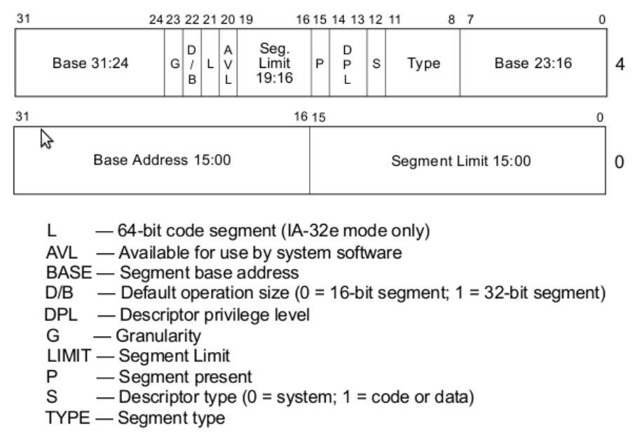

# GDT - The Global Descriptor Table

Defines memory segments and their protected-mode attributes.

## Segment Descriptors

An 8-byte structure that defines a protected-mode segment. It
has the following properties:
- Base address of 32 bits, defining where a segment begins in physical memory
- Segment limit of 20 bits, defining the size of a segment
- Other flags affecting how the CPU interprets the segment



*Note that the base address and segment limit are actually fragmented

[Wikipedia Article](https://en.wikipedia.org/wiki/Segment_descriptor)

### The Null Descriptor

An invalid segment descriptor that the CPU requires as the first entry to the GDT.

This descriptor makes it so we can catch mistakes if we forget to set a segment register;
addressing using the null descriptor causes the CPU to raise an exception.

The null descriptor looks like:
```bin
00 00 00 00
00 00 00 00
```

## Basic Flat Model

The simplest workable configuration of segment registers, where we have
two overlapping segments of addressable memory for *code* and *data*

### The *code* Segment

- Base Address: `0x00000000`
- Segment Limit: `0xfffff`
- Segment Present: `1` - since segment is present in memory; used for virtual memory
- Descriptor Privilege Level: `0` - the highest privilege
- Descriptor Type: `1` - 1 for code and data segment, 0 is used for traps
- Segment Type: (`1010` or `0xa`)
    - Code: `1` - This is a code segment
    - Conforming: `0` - Non-conforming means code in a segment with a lower privilege may not call code in this segment - key to memory protection
    - Readable: `1` - Allows us to read constants defined in the code, 0 if execute-only. 
    - Accessed: `0` - Often used for debugging and virtual memory techniques, since the CPU sets the bit when it accesses the segment
- Other flags: (`1100` or `0xc`)
    - Granularity: `1` - Multiplies our limit by 4096 (i.e. $16\cdot 16\cdot 16$), so our `0xfffff` would become `0xfffff000`, allowing our segment to span 4GB of memory
    - Default Operation Size: `1` - Our segment will hold 32-bit code, otherwise we’d use 0 for 16-bit code. This actually sets the default data unit size for operations (e.g. `push 0x4` would expand to a 32-bit number, etc.)
    - 64-bit code segment: `0` - Unused on 32-bit processor
    - AVL: `0` - We can set this for our own uses (e.g. debugging) but we will not use it

So, the segment descriptor for the *code* segment looks like:
```bin
00 cf 9a 00
00 00 ff ff
```

### The *data* Segment

Identical to the *code* segment, aside from the following segment type:
- Segment Type: (`0010` or `0x2`)
    - Code: `0` for data
    - Expand down: `0` - If clear, the segment expands from base address up to `base+limit`. If set, it expands from maximum offset down to limit, a behavior usually used for stacks
    - Writable: `1` - Allows the *data* segment to be written to, otherwise read-only
    - Accessed: `0` - Same as the *code* segment

So, the segment descriptor for the *data* segment looks like, with the `a` swapped for a `2`:
```bin
00 cf 92 00
00 00 ff ff
```

## The GDT Descriptor

The CPU needs to know how long our GDT is, so instead of just giving it the address of the GDT, we give it a GDT descriptor, which is composed of
- the size of the GDT (16 bits), and
- the address of the GDT (32 bits).

